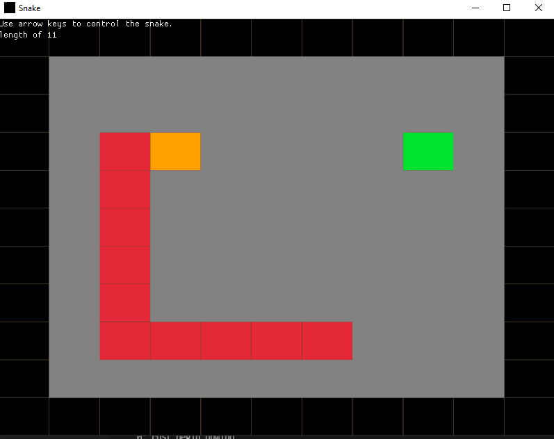

# Snake

I read somewhere that if you are interested in gamedev, you should start out small.

Ever since learning programming at Uni, I have (like many people getting into 
Software) been interested in making games. However, I've always been too 
ambitious, and lost interest after a day or 2.

This is a snake clone made over the course of 2 days (Sunday the 30th of January
and Monday the 31st, 2022) using Rust and Macroquad.

The code is poorly organized (all in one file), but I'm proud to have actually 
finished something. Maybe for my next game I'll try and organize the code better. :)